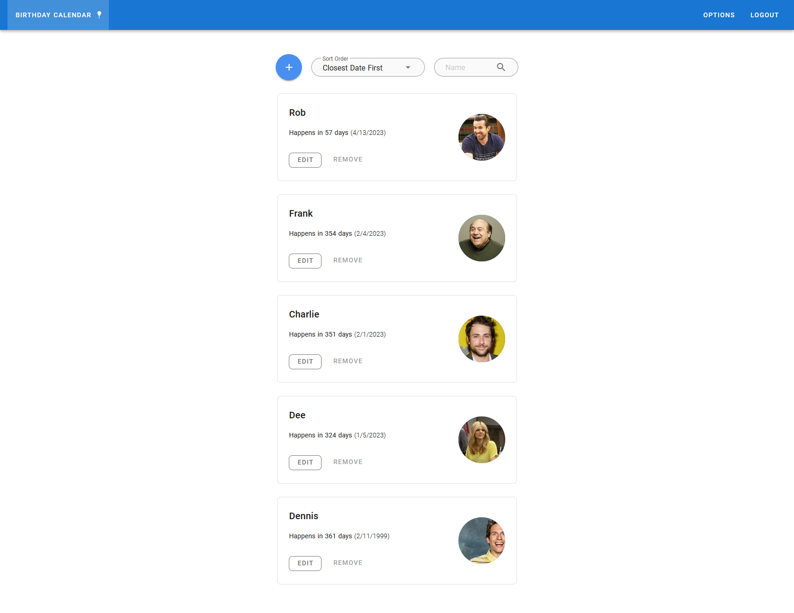

# Mazal Tov

Mazal Tov is a self hosted web application for keeping track of people's birthdays.



Noteable features:

- `Vue` Frontend Server Side Rendering (natively powered by `Nuxt2`).
- `Helm` chart included for streamlined deployment.
- Slick web interface with a list display of all stored birthdays (powered by `Vuetify`).
- Avatar display for each birthday (powered by `Django ImageKit`).
- Multiple users support (powered by JWT auth using `Djoser`).


## Self Hosting

Mazal Tov can be self hosted on most K8s clusters (currently tested on K3s) using the provided helm chart, located at the `charts` folder.

Applying the Helm chart requires setting a value for Django's `secret_key`. This is done by setting the `backend.key` property in the root `values.yaml` file, with the desired private key. Please note, that this value must be base64 encoded.


## Dev Prerequisites

Make sure to have Helm, K3d and Tilt installed.

H3lm version `v3.7.1`, K3d version `v4.1.0` and Tilt version `v0.22.3` were used when configuring this repository.


## Development

To create the cluster, deploy and watch files:

```s
$ k3d cluster create --config k3d.yaml
$ tilt up
```

To delete the cluster:

```s
$ k3d cluster delete birthdays
```
